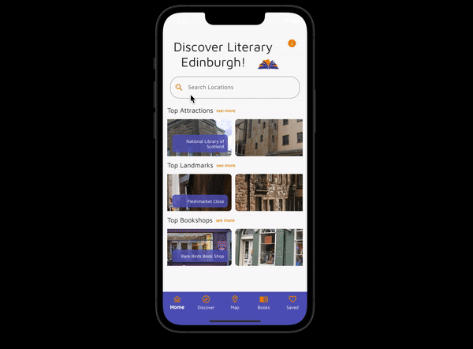
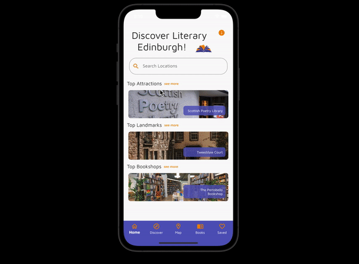
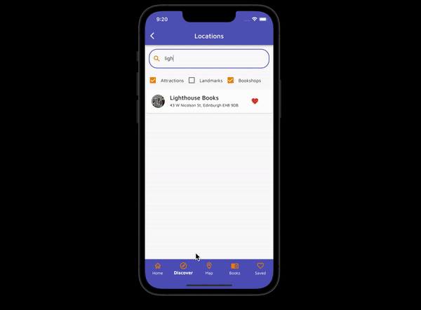
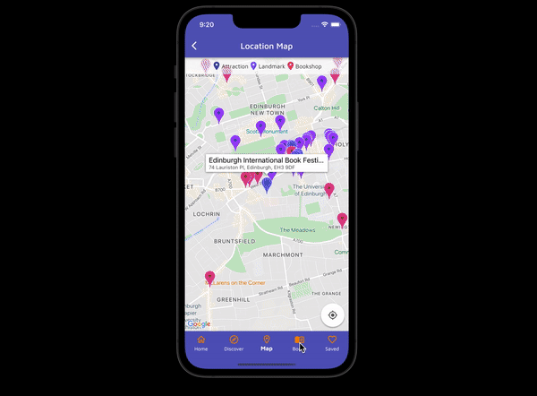
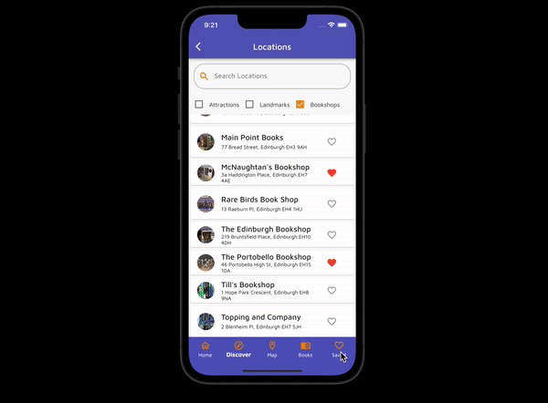

# edin_lit_companion

Edinburgh Literary Companion is a mobile application that was created using Dart and Flutter. The application is available on Android, iOS and web.

We chose Android Studio as our IDE. If you can prefer, you can use Visual Studio Code or Emacs as your editor.

- Capstone project for [CodeClan]
- Developed by KCDC (Kevin, Claire, Daniel, Cordelia)

## Mobile App - Edinburgh Literary Companion

The app was designed as a companion for those who want to explore Edinburgh's famous attractions, landmarks and bookshops. The app also lists books which are based in Edinburgh.

 - Discover Edinburgh: Users can search through all attractions, landmarks, bookshops and books. Filters are also available to help users narrow their search.
 - Plan Your Trip: Users can save their favourite locations and books.
 - Useful Information: All locations include an image, description and address. Website addresses are also displayed, when available.
 - Map: All locations are displayed as markers on a dedicated map page.
 - User-Friendly: The bottom navigation bar allows users to easily navigate to all key areas of the app.
 - Offline Usage: All features and functionality of the app are available offline. This allows users to use the app effectively around Edinburgh without relying on a data connection.

### How to Install

The Github repo for Edinburgh Literary Companion can be cloned to your computer using the following command:

- git clone git@github.com:CordiiT14/edinburgh_literary_companion.git

After cloning the repo, please create a .env file in the root directory and add your own Google Maps API key to this file using: 

GOOGLE_MAPS_API_KEY=YOUR_API_KEY_GOES_HERE

### Future Development of Edinburgh Literary Companion

Our original goal (MVP) for this project was:

- To learn how to create a mobile application using Dart and Flutter
- Allow users to view locations in a list and map
- Filter locations by type: Attraction, Monument and Bookshop
- Select location to view additional information
- Search through locations
- Allow users to view and save book recommendations

We are happy to have added all the essential features we had planned for. As this was our final group project, we had a limited amount of time to learn Dart and create our mobile application. 

As such, there are a number of features and functionality we would like to tackle when we have more time.

- Routes: Allow users to select locations and view the route from one to another location.
- Walking Tour: Create a walking tour from a selection of popular locations.
- App Theming: Create an app theme to help manage colours and styling.
- Persistent Data: Allow users to save data locally.
- Tablets & Web: Optimise app design so it looks better on tablets and web apps.

### What We Learned

We are all proud of what we achieved in this project. 

- In a short space of time, we were able to learn the Dart programming language and the Flutter framework, despite no exposure to either. 
- This was our first foray into mobile development. We faced many challenges along the way, but it has ultimately been a rewarding experience.
- Our experience in Python, Javascript and Java, gave us a great foundation for tackling this project.

### App in Action

Home and Location View:

Filtered Discover & Search:

Map View and Location View:

Books:

Saved Books and Locations:

